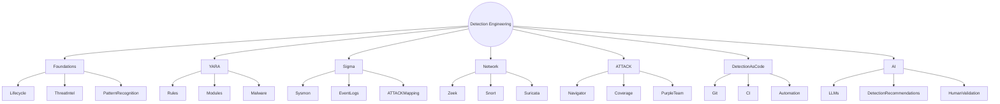
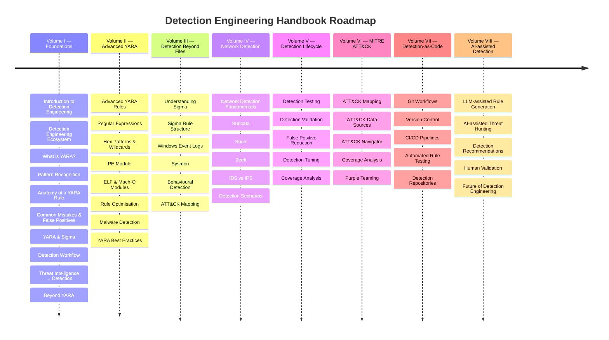
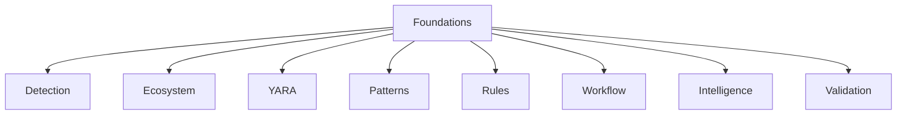
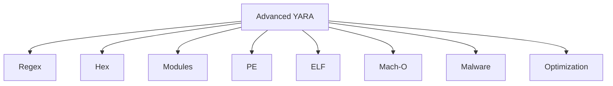
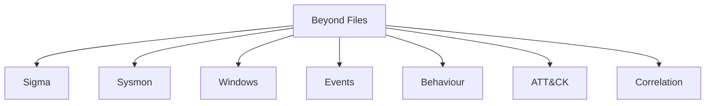
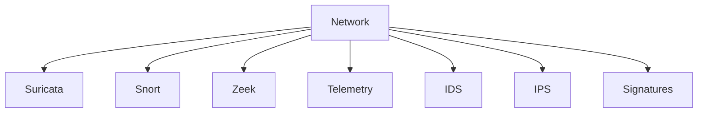
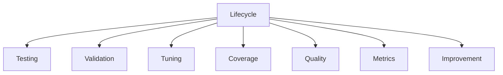
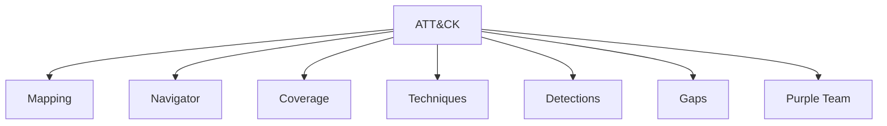
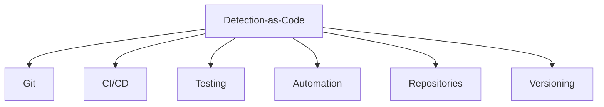
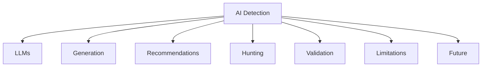

<div align="center">

# Detection Engineering Handbook

### Building Better Detection Through Intelligence

An open handbook exploring modern Detection Engineering, YARA, Sigma, Threat Intelligence and practical detection strategies.




---

Created by **OrchiCyb**

*Independent Cybersecurity Research Lab*


</div>

---

## About

Detection Engineering is no longer limited to writing signatures or detection rules. Modern defenders must continuously transform intelligence into actionable detections that evolve alongside adversaries, technologies and attack techniques.

The **Detection Engineering Handbook** is an open educational project created to bridge the gap between threat intelligence, detection logic and defensive engineering. Rather than focusing on a single technology, the handbook presents Detection Engineering as a complete lifecycle—from understanding attacker behaviour to building, validating, deploying and continuously improving detections.The goal of this handbook is to provide practical knowledge supported by real-world examples and industry best practices.




---

# Handbook Roadmap
The handbook is designed as a multi-volume learning resource.


## **PART I: Foundations of Detection Engineering**
Learn the core principles behind modern Detection Engineering.



### Chapters
- WHAT IS DETECTION ENGINERING?
- The Detection Engineering Ecosystem
- WHAT IS YARA?
- Detection Engineering as Pattern Recognition
- ANATOMY OF YARA RULE
- Common Mistakes & WHY FALSE POSITIVES MATTER
- YARA & Sigma - Why They Are Complementary?
- Detection Engineering Workflow
- From Threat Intelligence to Detection
- Beyond YARA

## **PART II: Advanced YARA & Malware Detection**
Move beyond basic signatures and build production-ready YARA rules.



### Chapters
- Advanced YARA Rules
- Regular Expressions
- Hex Patterns & Wildcards
- PE Module
- ELF & Mach-O Modules
- Writing High-Quality Rules
- Optimising Rule Performance
- Real-world Malware Detection
- YARA Best Practices

## **PART III: Detection Beyond Files**
Expand detection beyond malware files into behavioural analytics.



### Chapters
- YARA vs Sigma
- Understanding Sigma Rules
- Sigma Rule Structure
- Windows Event Logs
- Sysmon Fundamentals
- Practical Sigma Examples
- Mapping Sigma to ATT&CK

## **PART IV: Network Detection Engineering**
Understand how modern network detections are designed.



### Chapters
- Network Detection Fundamentals
- Suricata
- Snort
- Zeek
- Network Telemetry
- IDS vs IPS
- Writing Network Signatures
- Practical Detection Scenarios

## **PART V: Detection Engineering Lifecycle**
Detection is a continuous engineering process.



### Chapters
- Detection Engineering Workflow
- Detection Testing
- Detection Validation
- Reducing False Positives
- Detection Tuning
- Measuring Detection Quality
- Detection Coverage

## **PART VI: Detection Engineering & MITRE ATT&CK**
Build detections aligned with adversary behaviour.



### Chapters
- ATT&CK Mapping
- ATT&CK Data Sources
- ATT&CK Detections
- ATT&CK Navigator
- Coverage Analysis
- Detection Gaps
- Purple Teaming

## **PART VII: Detection-as-Code**
Treat detections like software.



### Chapters
- Detection-as-Code
- Git-based Detection Management
- Version Control
- CI/CD for Detections
- Rule Testing Automation
- Detection Repositories

## **PART VIII: AI-assisted Detection Engineering**
Explore how AI can augment modern detection engineering.



### Chapters
- AI-assisted Detection Engineering
- LLMs for Rule Generation
- AI-assisted Threat Hunting
- Detection Recommendations
- AI Limitations
- Human Validation
- Future of Detection Engineering

---

# Repository Structure

```text
detection-engineering-handbook/
│
├── handbook/
│   ├── Detection Engineering Handbook: PART 1 - YARA.pdf
│   ├── part-02/
│   ├── part-03/
│   ├── part-04/
│   ├── part-05/
│   ├── part-06/
│   ├── part-07/
│   └── part-08/
│
├── examples/
│   ├── yara/
│   ├── sigma/
│   ├── suricata/
│   ├── snort/
│   └── datasets/
│
├── resources/
│   ├── references.md
│   ├── books.md
│   ├── papers.md
│   └── tools.md
│
├── CONTRIBUTING.md
├── LICENSE
└── README.md
```

---

# Download

The latest handbook is available in the **handbook/** directory.

---

# Repository Goals

This repository aims to:

- provide high-quality educational material
- bridge theory and practical Detection Engineering
- encourage community learning
- promote evidence-based cybersecurity research

---

# References

This handbook draws upon publicly available resources including:

- MITRE ATT&CK
- YARA Documentation
- Sigma HQ
- Microsoft Security
- Elastic Security
- CISA
- SANS Institute
- NIST Cybersecurity Framework

Additional references are provided throughout the handbook.

---

# Contributing

Community feedback is always welcome.

If you identify inaccuracies, have suggestions for improvement or would like to contribute practical examples, feel free to open an Issue or submit a Pull Request.

---

# License

This project is licensed under the MIT License.

The handbook content remains Copyright © 2026 OrchiCyb.

---

<div align="center">
